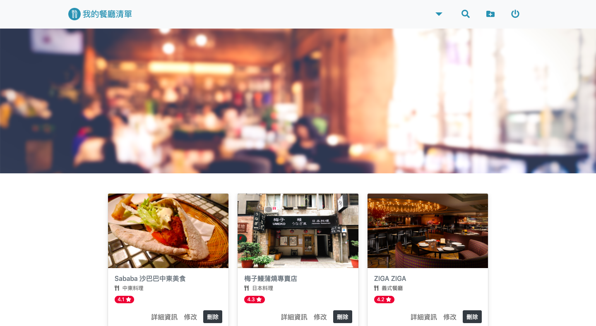

# Restaurant-List

## A web app build with express, a list that user can build restaurant list.



## Features

- you can see all restaurant on home page
- you can search restaurant by their name and category
- you can create a new restaurant list
- you can see the detail of a restaurant
- you can edit the detail of a restaurant
- you can delete a restaurant
- you can register/login

  
  


### How to install

- press "Clone or download" button to get the https URL
- type 'git clone' and paste the URL on terminal
- go into the project
- type 'node app.js' on terminal to start the server
- you can see this web on localhost:3000

### How to import seeder

```
node .\models\seeds\seeder.js
```

### Build with

- [Express](https://expressjs.com/zh-tw/starter/installing.html)
- [Handlebars](https://www.npmjs.com/package/express-handlebars)
- [MongoDB 4.0.X](https://www.mongodb.com/download-center/community)
- [Mongoose](https://www.npmjs.com/package/mongoose)
